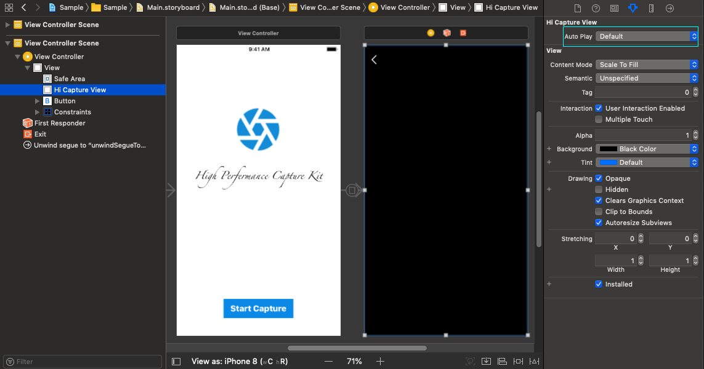

# Usage

### Storyboard

不需要写代码也可以使用。

在 Storyboard 中设置您要显示的 View 为 `HiCaptureView` 即可。如下图，您也可以参考 [Sample](Sample/Sample/Base.lproj/Main.Storyboard)。

> 注意：
> 
> Auto Play 属性表明当 Capture View 初始化后是否马上显示摄像头内容。

### Code

* 使用 `HiCaptureView` 显示，使用非常方便。
* 使用 `HiCapture` 获取数据流，接口易用。
* 使用 `HiCapture` 和 `HiCapturePreview` 自定义显示内容，使用方便。
* 使用 `HiCapture` 和 OpenGL/Metal 自定义显示内容，自定义程度相对更高，您可以添加 Shader 渲染出更酷的效果，但是使用也相对繁琐。